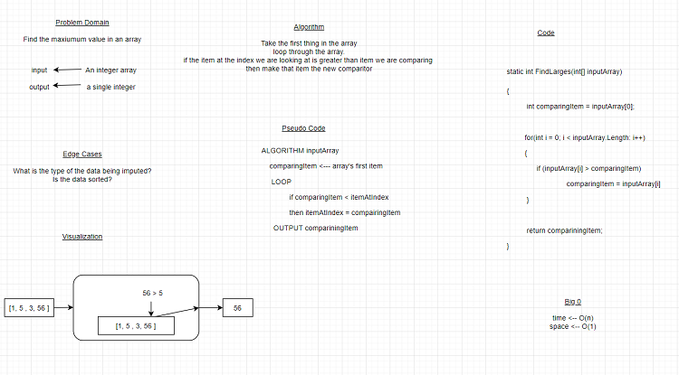

# Lab 03: System I.O and Review of C#

## About Me

*Author: Trevor Stubbs*

----

## Description 
This is a C# console application that will demonstrates the use of `System.IO` and to help me practice my CSharp knowledge.

---

### Getting Started
Clone this repository to your local machine.

```
$ git clone https://github.com/TrevorStubbs/Lab02-UnitTestingAndDocumentation.git
```

### To run the program from Visual Studio:
Select ```File``` -> ```Open``` -> ```Project/Solution```

Next navigate to the location you cloned the Repository.

Double click on the ```Lab03SystemIOAndReviewOfCSharp``` directory.

Then select and open ```Lab03SystemIOAndReviewOfCSharp.sln```

---

### Visuals
#### Application Start

#### Using the Application

#### Application End

#### WhiteBoard of Challenge 5


---

### Change Log
- 1.8: Challenge 7 Complete
- 1.7: Challenge 6 Complete
- 1.6: Challenge 5 Complete
- 1.5: Challenge 4 MostDuplicats Method Complete
- 1.4: Challenge 3 MakeStar method Complete
- 1.3: Challenge 2 GetAverage Method finished
- 1.2: Challenge 2 Caller Method Complete with edge cases
- 1.1: Challenge 1 Complete
- 1.0: Initial Repo Setup
